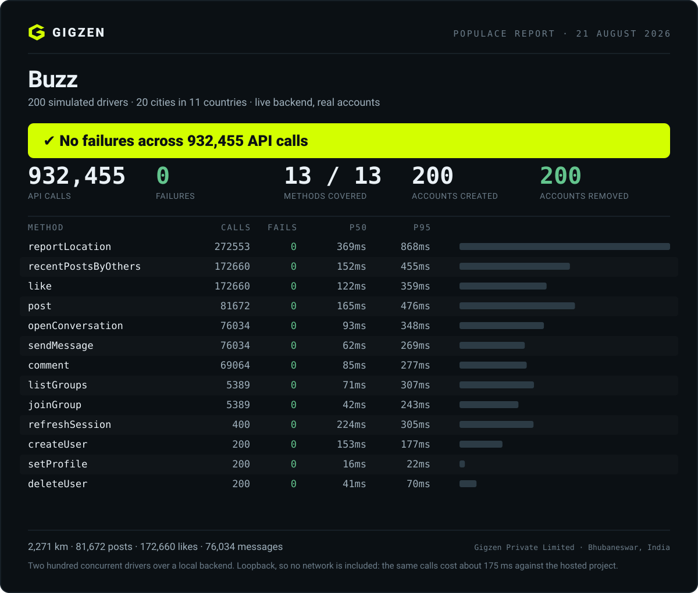

# Populace

**A simulated population that uses your app through its real API — so you can
test what needs more than one person.**

```bash
npm install -g @gigzen/populace
populace demo
```

**Site:** https://shakhtar-sankur.github.io/populace/ &nbsp;·&nbsp;
**Test report:** [the full engineering record](https://shakhtar-sankur.github.io/gigzen/test-report.html)
&nbsp;·&nbsp; A [Gigzen](https://shakhtar-sankur.github.io/gigzen/) product

Some bugs only exist when two people are using your app at the same time.
Presence, live sync, read receipts, notification fan-out, "does deleting this
remove it for everyone", and every permission rule you wrote — none of them can
be tested by one developer with one account, however carefully they tap through
every screen.

Populace gives you a few dozen believable people who sign up, move around a real
city, post, like, comment, message each other and join groups — as **real
authenticated users**, through **your own API**, with **your own permission rules
applying**. Then it hands you a report on what broke.

---

## It has done this to a real, finished app



That is the *second* run. The first one is the interesting one.

### What happened, in plain English

On **9 August 2026** we pointed Populace at **Buzz** — a gig-worker platform
on Android with a live Postgres backend, 17 tables and 48 row-level-security
policies. It was finished. It was signed. It had been through a full manual test
of every screen by the person who wrote it, and it had passed.

We started six simulated drivers: three in **Manila**, three in **Mumbai**. Each
one signed up for a real account, set a profile, started driving a plausible
route through real streets, and behaved like a person — posting about traffic,
reading the feed, liking and commenting on what other drivers posted, opening
conversations, sending messages, joining a group. Nobody told Populace where the
bugs were. Nobody told it what to look for. It just used the app.

**Three and a half minutes later it had found five bugs.** The app that had
passed a full manual test could not create a working account.

### The five, one at a time

**1. Signing up created no profile — every new user was broken.**
A privacy fix earlier that day had restricted write access on the `profiles`
table to a named list of columns, so that phone numbers could never be read by
other users. The signup code used an *upsert*. In Postgres, `INSERT … ON CONFLICT
DO UPDATE` needs `SELECT` permission on every column it touches — and one of
those columns was, deliberately, unreadable. So the write was refused. Silently.

Every account created after that point existed in the auth system with no
profile row behind it. Then every post, every comment and every group join died
on a foreign key pointing back at the row that was never written.

*Why one person never sees this:* their own account already exists. You only hit
it on a **fresh signup**, and you only notice the damage when that new user tries
to do something. Populace creates six brand-new accounts every run, which is why
it hit the bug in the first fifteen seconds.

**2. Likes bounced back, at random.**
The `post_likes` table has an insert policy and a delete policy, and no `UPDATE`
policy — by design. The app used an upsert here too, so the second time anyone
liked a post, it became `ON CONFLICT DO UPDATE` and row-level security refused
it. The feed refreshes every 2.5 seconds, so a slightly stale "already liked"
state was completely ordinary, and one tap in four failed.

*Why one person never sees this:* with one account and one slow thumb, you rarely
double-like anything. Six people liking each other's posts on a 2.5-second poll
do it constantly.

**3. Editing your profile failed the same way.** Same upsert, same unreadable
column, same silent refusal.

**4 and 5. Two faults in Populace's own reference adapter.**
One passed an RPC argument under the wrong name. The other is the one worth
dwelling on: it **ignored the error returned by a write**. Because that failure
was swallowed at signup, the report blamed a *later* method for it — so the run
said "post failed 14 times" when the truth was "the profile row was never
created."

An unchecked error is the precise fault this tool exists to catch, and it was
sitting in our own code. Making that one line throw changed the report from three
confusing symptoms into one sentence naming the real cause: *profile row not
created: permission denied for table profiles.*

### The rule worth taking away

> **You cannot upsert a column you cannot select.**

Three of the five bugs were the same mistake wearing different clothes. It is
invisible in code review, invisible in a single-user walkthrough, and obvious
within seconds to six users signing up at once.

### After the fixes

All five were fixed, and the runs since have grown by three orders of magnitude.
The report at the top of this page is the largest that was **clean end to end**:
**no failures across 932,455 API calls**, 200 concurrent drivers over 20 cities in
11 countries, 200 accounts created and 200 removed.

A later run put **300 drivers through 1,401,435 calls with zero API failures** — but
one call never reached the server, a socket exhausted on the test machine, so
Populace marked it *inconclusive* rather than clean. That distinction is the point:
a verdict that is never withheld is worth nothing when it is given.

**What this does not claim.** These runs are against a **local backend over
loopback**, so no network is in the latencies — the same calls cost about 175 ms
against a hosted project. Three hundred drivers is where throughput stops scaling,
not where the app breaks; that is still unfound.

---

## Try it in ten seconds

No backend, no signup, nothing of yours touched — the demo adapter fakes a small
app in memory.

```bash
populace demo
```

The demo app has a real bug in it: a row-level-security policy that rejects
likes. Watch the report find it, name the policy, and exit non-zero. That exit
code is the whole point — the run fails your build rather than telling you it
went fine.

Two files land in whatever directory you ran it from: `populace-report.json` for
CI, and `populace-report.html`, which is one self-contained page you can email
to someone who was not watching your terminal.

---

## Point it at your own app

```bash
populace init      # scaffolds populace.config.mjs + adapters/my-app.mjs
populace doctor    # checks config, reachability and coverage WITHOUT running
populace run
populace clean     # removes every account a run created
```

You write **one adapter** — thirteen small methods, each answering "how does
this happen in my app?". Two are required (`createUser`, `deleteUser`);
everything else is optional and anything you skip is reported as untested rather
than quietly passing. Full spec in [adapters/contract.md](adapters/contract.md),
and [adapters/buzzbuzz.mjs](adapters/buzzbuzz.mjs) is a complete real-world
example in ~150 lines.

`populace doctor` on a fresh scaffold says `2/13` and refuses to run — a method
that exists but does nothing is not coverage.

### Check the adapter before you run

`doctor` tells you which methods exist. `smoke` tells you whether they work:

```bash
populace smoke
```

It creates one user, calls every method you implemented once, checks what came
back against what the contract promises, and deletes the user again. Seconds,
not minutes — and it reports on *your adapter*, not your app, which is the
question you actually have while writing one.

A full run against a subtly wrong adapter spends five minutes producing a report
about nothing. This is the step that stops that.

**If your API uses expiring tokens, implement `refreshSession`.** Without it,
any run longer than your token lifetime collapses at once and the report blames
your API for what were really expired tokens — and the run cannot even delete
its own accounts, stranding simulated users in your environment. See it happen:
`node examples/token-expiry/expiry-demo.mjs`


### And to an app we did not write

Pointed at a local [Gitea](https://gitea.io) instance — a git forge, not a social
app, and nobody here has touched its source:

```
POPULACE REPORT — Gitea
✔ No failures across 1106 API calls.

  recentPostsByOthers   382   0   364ms   879ms
  like                  382   0   186ms   520ms
  post                  173   0   575ms    1.2s
  comment               139   0   405ms   771ms
  createUser             10   0   116ms   183ms
  setProfile             10   0    59ms    77ms
  deleteUser             10   0   336ms   410ms

  NOT TESTED — adapter implements 8/13
✔ Cleanup complete — 10 accounts removed.
```

Gitea has no location tracking, no direct messages and no group joins, so five
methods have no equivalent. They are **absent from the adapter rather than
stubbed**, and the report says which and what each would have covered — because
a stub returning a fake success turns "we did not test this" into "this works".
Posting is opening an issue; the feed is listing other people's; liking is a
reaction.

Ten accounts created through Gitea's own signup, driven under Gitea's own
permissions with per-user tokens, and ten removed — checked inside Gitea
afterwards, not taken from this tool's own report.

**It found five defects on the way in, all of them in Populace.** Gitea's OpenAPI
description has 482 operations against the 18 in the fixture the adapter
generator was built on, and at that scale it mismatched four methods whose
correct endpoint was right there in the spec: it summed path-word hits instead of
taking the best, penalised path depth too weakly, matched `"registration"` inside
a CI-runner token endpoint, and — the good one — matched `"dm"` inside
`"admin"`. All fixed; the confidence markers are what stopped the wrong guesses
from looking finished.

## It tells you what to do about it

A report that says `duplicate key value violates unique constraint` has told you
what happened and nothing about what to do. Every run now ends with the part
that matters:

```
  WHAT TO DO
    12 failures in the application.

    [YOUR APP]  like × 12
      The database refused the write on permissions, not on data.
      A row-level-security policy rejected this call for the signed-in role.
      The request was well formed; the policy did not allow it. This is
      invisible to whoever wrote the policy, because their own account
      usually satisfies it.
      Fix:
        Check the policy for this table against the role the app
        authenticates as, and confirm there is a policy for this specific
        command — a table with only a SELECT policy refuses every INSERT.
```

**The first judgement is the one that matters: was this your application at
all?** A socket that never opened and a 500 look equally red in a terminal and
mean completely different things. Every failure is attributed to your app, the
platform, or the test client, and the summary line says so before any detail:

```
No application failures — 21 never reached the server.
```

A failure Populace cannot recognise is reported as unrecognised. It is never
counted as "not your app", because that would turn *we could not tell* into an
all-clear.

### When no rule fits

Rules cover the shapes a simulated population usually provokes. For anything
else, `populace explain` can ask a model:

```bash
export ANTHROPIC_API_KEY=sk-ant-...
populace explain
```

Rules run first and the model only ever sees what they could not name — so most
runs never call it at all, and the ones that do send a handful of short strings.
Explanations that came from the model are labelled as such.

**What is sent, exactly:** the method name, the error text, how many times it
happened, and that method's p50/p95. Nothing else — no target URL, no keys, no
tokens, no request bodies, no simulated users' content. Run with `--verbose` to
print it before it leaves.

```
  Sending to the model — this is everything, nothing else leaves this machine:
    [ { "method": "post", "error": "quorum lost on shard 3 …",
        "occurrences": 9, "p50ms": 40, "p95ms": 120 } ]
```

The model layer can never break a run. No key, a rejected key, a rate limit, a
refusal, a malformed reply — each prints one line and falls back to the rule
output. `populace explain` is a separate command for the same reason: a run
should not wait on somebody else's network, and a report is complete without it.

## Start from your API description

Writing the adapter is the slow part: thirteen methods against your endpoints.
If your API has an OpenAPI description, Populace can fill most of it in:

```bash
populace init --from-openapi openapi.json
```

It reads every operation, matches them against the thirteen contract methods by
path, verb and description, and writes the adapter with each confidence marked:

```
  Read 18 operations from openapi.json and matched 13 of 13.

    ✔ createUser            POST /auth/signup
    ✔ like                  POST /posts/{postId}/likes
    ? joinGroup             POST /groups/{id}/members
        low confidence — check this one
    ✖ reportLocation        left as the template default
```

Path parameters become real template literals — `` `/posts/${postId}/likes` ``,
not the literal string — so the adapter runs rather than requesting a URL with
braces in it.

**This is a guess and the generated file says so.** Request bodies, field names
and response shapes are still the template's defaults. It removes the half hour
of looking endpoints up; it does not finish the job. Run `populace smoke` next —
it calls every method once and names the first one that is wrong.

A verb match alone is never enough to claim a method: a spec containing only
`/health` matches nothing, rather than guessing that a lone `GET` is your feed.

JSON only. A YAML parser would be Populace's first runtime dependency, and
`npx js-yaml openapi.yaml > openapi.json` covers it.

## Run it in CI

Populace is a GitHub Action, so a population can run against your staging
environment on every pull request:

```yaml
- uses: Shakhtar-Sankur/populace@v1
  with:
    agents: 30
    minutes: 10
  env:
    MY_API_URL: ${{ secrets.STAGING_URL }}
    MY_API_KEY: ${{ secrets.STAGING_KEY }}
```

Your credentials stay in your repository's secrets and are read by your own
adapter. **Populace never sees them and nothing is sent anywhere** — the run
happens on your runner, against your server.

The job fails when the run is not clean, and the per-method table is written to
the job summary, so the result is visible in the pull request without
downloading an artifact.

| input | default | |
|---|---|---|
| `config` | `populace.config.mjs` | path to your config |
| `agents` `minutes` `tick` `engagement` `cities` | from the config | overrides |
| `report` | `populace-report.json` | the HTML lands beside it |
| `working-directory` | `.` | |
| `fail-on-problems` | `true` | set `false` to record without breaking the build |

Outputs `verdict`, `calls`, `api-failures`, `transport-failures`,
`report-json` and `report-html` for later steps:

```yaml
- uses: actions/upload-artifact@v4
  if: always()
  with:
    name: populace-report
    path: ${{ steps.populace.outputs.report-html }}
```

**`api-failures` is the number about your app.** `transport-failures` counts
calls that never reached your API at all — a flaky runner, not your code — and
Populace reports a run with any of those as *inconclusive* rather than clean,
because it cannot vouch for a call it could not make.

## The safety guard

Populace creates real accounts and writes real rows. Pointed at production it
would put invented people in front of paying customers. So it refuses to start
in three independent ways:

1. **`environment` must declare a non-production value.** Opt in, never assumed.
2. **`neverRunAgainst` is checked against every string in your target** — however
   deeply nested. One match and the run is refused; no flag overrides it.
3. **An empty denylist warns loudly**, because "I forgot to fill that in" is the
   likeliest version of this mistake.

Refusals exit non-zero, so CI catches them too.

The same principle runs through the contract: **go through the front door**. Use
the API your app actually uses — not admin keys, not service-role credentials,
not direct database writes. A simulation that bypasses your permission rules
proves nothing about whether they work, and permission bugs are exactly what a
multi-user simulation is best at finding.

---

## What you get

- **A populated app** instead of an empty one — the cold-start problem, solved for demos and for judging your own UX
- **Multi-user paths exercised** without recruiting humans: presence, receipts, realtime fan-out, membership counts
- **Permission rules tested by users who genuinely have different identities**
- **Latency per endpoint** (p50/p95/p99/max) under N concurrent users
- **Failures grouped by shape**, not exact text, so one bug is one line rather than fifty
- **Account deletion actually tested** — the path almost nobody exercises and the one regulators ask about
- **`populace-report.json`** for CI; the run exits non-zero when problems are found
- **`populace-report.html`** beside it — one self-contained file, no scripts and nothing
  fetched from the network, for the people who were not watching the terminal

### A run always finishes

Every call into your adapter has a deadline (`timeoutMs`, 20s by default). Past
it, Populace stops waiting, records a timeout against that endpoint, and the
other agents carry on.

This matters more than it sounds. We found it the hard way: a real run against a
flaky link froze two minutes in and sat there silently until something outside
killed it nine minutes later. No report, no error — just a progress line that
stopped moving. The API under test was fine; one dead socket had taken the whole
run with it.

A hang is the worst outcome a testing tool can produce, because it does not look
like a failure. It looks like nothing, and the natural conclusion is that the
tool is broken. So now a slow or unresponsive endpoint becomes **a line in the
report**, which is a finding you can act on — and the run still ends with a
verdict. Set `timeoutMs: 0` if your adapter does long work on purpose.

---

## What it will not tell you

**Whether people want your product.** These people are generated from patterns.
They will never surprise you the way a real customer does, they cannot tell you
your onboarding is confusing or your pricing is wrong, and they are least
accurate for exactly the users least represented online.

Use Populace to prove your app **works**. Use real people to decide what to
**build**. A report full of green ticks means your API held up — not that anyone
wants what you made.

---

## Design notes

- **The engine never learns your app.** `src/engine/` knows how to be a person;
  everything app-specific lives in an adapter. If app logic ever leaks into the
  engine, Populace has collapsed back into a test script.
- **Zero runtime dependencies.** Adapters bring their own.
- **Deterministic identities.** Agent *n* always gets the same phone number, so
  re-runs reuse accounts instead of piling up new ones — and `populace clean`
  can find them after a run that crashed halfway.
- **Cheap by default.** Scripted agents cost nothing, so hundreds can run at
  once. If you later want genuinely emergent conversation, put an LLM behind a
  tier — a handful of expensive agents among many cheap ones, the way games vary
  NPC detail.
- **Concurrent, not sequential.** Everyone acts at once, because sequential
  agents never surface a race condition.

```bash
npm test   # runs the whole product against an in-memory app — no backend needed
```
